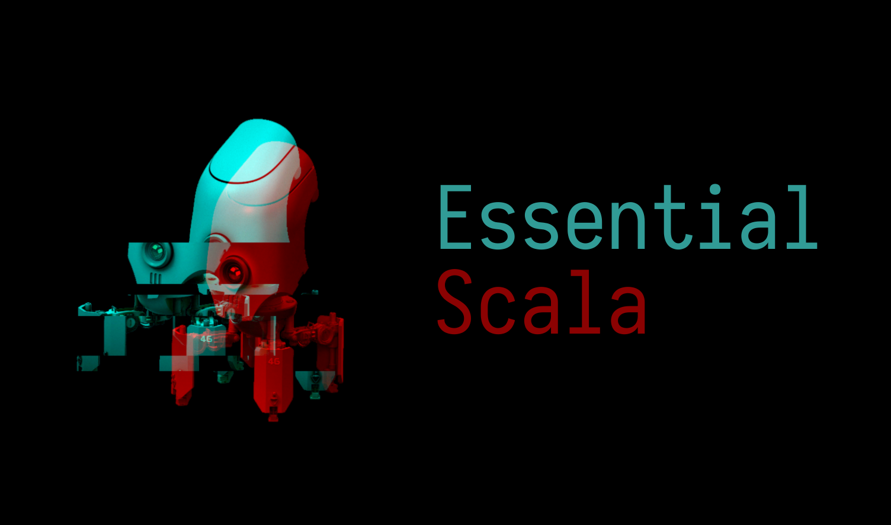

# Essential scala



## About

This repository contains solutions to the [Essential Scala](https://underscore.io/books/essential-scala/) book.

The catalog structure is following:

```bash
essential-scala
├── ...
└── 1-problem-name
    ├── solution.scala
    └── task.md
```

Optionall it can have an alternative solution in
`solution.alt.scala`. Sometimes it also has an `extra.md`
file with interesting question about scala semantic.

## List of tasks

Here is complete table of all tasks:

1. [Type and Value](./tasks/1-type-and-value/task.md)
2. [Operator Style](./tasks/2-operator-style/task.md)
3. [Literal Objects](./tasks/3-literal-objects/task.md)

## Meta

Author: [Sierikov](github.com/sierikov)  
License: [MIT](LICENSE.md)
